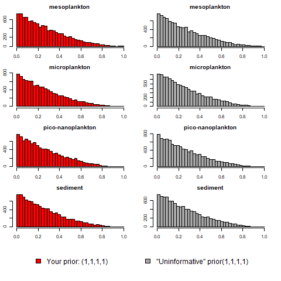

```{r, include=FALSE}
knitr::purl("Trophic_Ecology.Rmd", documentation = F)
```

# Analysing stable isotope data in R {.tabset}

## Background

### Who am I

Vianney Denis, Coral Reef Ecologist, National Taiwan University
A (too) broad interest on coral reefs from physiological ecology to ecosystem ecology.


### R and stable isotope data

You are probably already familiar or already probably heard about R. You may not be proficient in using it, and the aim of this class is to introduce some common and more advanced tools to analyse stable isotope in the field of trophic ecology. This class will not come back on general knowledge of what is an isotope and how they can be useful for ecology (see previous courses), but it will focus on more technical details which are how we analyse the data. In particular, we will navigate in R functions allowing to visualize stable isotope data and we will go through common R packages used in trophic ecology. 

I will use Posit (ex R Studio) for the demo. If you have it installed on your computer, you are welcome to use it but make sure it is updated with the latest version of R and Posit. This class has been optimized for a use with **posit** Cloud. You can register and use it  for free  with, of course, some limitation on computing time (25 hrs) and RAM (1GB). That should be okay for those two days. 

GUI of Posit is pretty standard: script editor, console, environment, files - plots - packages windows. That's all we need for now.

### R Markdown to load and plot data

This is an R Markdown document. A kind of R script but with some bonus taht let you to annotate and explain what you did. Markdown is a simple formatting syntax for authoring HTML, PDF, and MS Word documents. For more details on using R Markdown see <http://rmarkdown.rstudio.com>.

We'll use this to compile and store all the r code used during the class. This way you can edit and improve the scripts as you go on and even copy relevant sections for other projects. This markdown is being saved as a html document but you can also open the markdown directly as you will see on my screen.

Now we need to install and load the packages we will be using during the workshop. You can use the Packages wizard in posit (bottom right) to install each of these and then load them all using the following chuck of code. It is going to give you a few messages to let you know some info about the package versions but also if their is any problems with them  

```{r, message=F, warning=FALSE}
library (ggplot2)
library (reshape2)
library(plyr)
library(GGally)
library(SIBER)
library(MixSIAR)
library(R2WinBUGS)
library(splancs)
library(tidyr)
library(dplyr)
```

### Credit

To **Brian Hayden** (https://sites.google.com/view/brianhayden/home?authuser=0)
Amazing series of videos on trophic ecology and stable isotope analysis  on his website. Most of the content of this class is taken and adapted from his available teaching material. If you enjoy this class, visit his website and his YouTube channel.

## Data overview and familiarisation

### Preliminary data interrogation

Here we will load in an isotope dataset and have a look for outliers and other issues we need to be concerned about.

First load the data associated with this workshop (the file is named *Dataset*). We will manipulate and trasnform this dataset as we work)
This file contains carbon and nitrogen data for two coral species (one black coral and one gorgonian coral) and their possible food sources. Part of the data are publish and available at: https://www.sciencedirect.com/science/article/pii/S0272771418310606 

Generally speaking, your data should already have been tidied up, probably in Excel, so as to remove any of the additional lines at the start that often come back from analytical laboratories. R uses 'raw' format. It means you need to keep your datasheet very simple (no color ot any other fancy format). Just be boring. As with all data files, your first line (row) should be the names of each of the columns. When naming columns, it is important to not use any unusual, non-standard characters, as these can confuse the functions that are parsing (reading and processing) the datafile: if you need to separate words in a column header you should use "_" or ".", e.g. "delta_C" or "delta.C" but not "delta/C".

```{r, eval=TRUE}
# Load your data
Dataset <- read.csv("Data/Dataset.csv") # Import a file

#View the first 10 rows of data
head(Dataset) # see the head
```

Get familiar with the different variables. You can further examine the structure of this data `str(Dataset)`. Importantly, you can note that information on the station and depth have been merged together. Also note the missing data, mostly at the `tail` of the data set. For the purpose of this demonstration, we will remove useless variables and make a simplified dataset. 


```{r, eval=TRUE}
# Make a simplified dataset 
Data <- Dataset # Make a copy of the object
Data$CN <- (Data$mgC/Data$Weight*100)/(Data$mgN/Data$Weight*100) # Compute CN ratio
Data[,c("Reference", "Date_Station_Type", "Date", "Station", "Other", "RunNo" )] <-NULL # add NULL in the useless variables
head(Data) 
```

It is not so easy to get summary statistics on each category within our data set using the basic R functions. There are many packages out there to help, but Hadley Wickham's suite of packages are impossible to beat, and we will be using his `ggplot2` package for pretty graphs later on so lets stick with the ["Hadleyverse"](https://www.tidyverse.org/)  of functions. We installed `ggplot2` and `tidyr` packages, but the complete tidyverse collection can be installed with: `install.packages("tidyverse")`.

```{r, eval=TRUE}
# Some quick summary
## all categories
Data.sum.1<-ddply(Data, c("Season", "Category"), summarise,
                count = length(Category),
                mC = round(mean(d13C, na.rm=T), digits=1), sdC = round(sd(d13C, na.rm=T), digits=1), 
                mN = round(mean(d15N, na.rm=T), digits=1), sdN = round(sd(d15N, na.rm=T), digits=1))
head(Data.sum.1)
## coral only
Coral<-subset(Dataset, Type == "coral")
Coral.sum.1<-ddply(Coral, c("Season", "Category"), summarise,
                count = length(Category),
                mC = round(mean(d13C), digits=1), sdC = round(sd(d13C), digits=1), 
                mN = round(mean(d15N), digits=1), sdN = round(sd(d15N), digits=1))
head(Coral.sum.1)
```

Here, it is important to notice how managed here the missing data (`NA`) as it will influence later visualization and analysis. Also note that for stable isotope values, you should reduce decimal to match resolution of the mass spectrometer. 

There is quite a bit here but we can also use subset of the data set. 

```{r, eval=TRUE}
# A subset of the data set
A_subpinnata_spring<-subset(Data, Category == "A_subpinnata" | Season == "Spring")
head(A_subpinnata_spring)
```

### Basic Visualisation

Visualising the data is often the next step. You can generate histograms of the data very easily.Lets compare isotope ratios between the two coral species. Here we are primarily interested in d13C values of *A. subpinnata* and *E. cavolini*.

```{r, eval=TRUE}
# Plotting isotope data: d13C only (or any other variable)

New.data<-subset(Data, Category == "A_subpinnata" | Category == "E_cavolini")

Iso.boxplot<-ggplot(New.data, aes(x=Category, group = Category, y=d13C, colour=Category)) +                 
  geom_boxplot() +
  geom_point(position="jitter")+
  facet_grid(. ~ Season)

Iso.boxplot
```

You can save this plot (your first art work) in your working directory. The command below will save the above plot as a pdf file called `plot1` in your working directory (check `getwd`). 

```{r, eval=TRUE}
ggsave("Plots/d13C.pdf")
```


What about the other variables... 15N, C/N, etc.

```{r, eval=TRUE}
# Plotting isotope data: All at once with a step of melting and faceting the data set 

Melt.data<-melt(New.data, measure.vars  = c("d13C", "d15N", "CN"), variable.name= "variable", value.name="value") # idvar to explain

Melt.boxplot<-ggplot(Melt.data, aes(x=Category, group = Category, y=value, colour=Category, fill=Category)) +
  geom_boxplot(alpha=0.3, outlier.shape = NA) +
  geom_point(position="jitter") +
  facet_grid(variable ~ Season, scales = "free_y") +
  theme_bw()

Melt.boxplot
```

You can also save this plot because it is beautiful.

*Inorganic Carbon and lipid effects*

- Carbonate: First we want to test whether there is evidence for an effect of inorganic carbon on the carbon isotope values. If this was a factor we would expect to see a positive relationship between %C and d13C.

```{r, eval=TRUE}
# Carbonate effect
Carbonate.plot<-ggplot(New.data, aes(x=mgC, y=d13C)) +
  geom_point() +
  geom_smooth(method = "lm", se=T,formula=y~x) +
  facet_grid(Category ~ Season, scales = "free_x")

Carbonate.plot 
```

Indeed, the samples have already been acidified. The variation of δ13C indicated a decrease with a greater accumulation of carbon. 

- Lipid: As a general rule, lipids contain carbon but no nitrogen AND are 13C depleted relative to protein (i.e. muscle). So, lipid rich samples will be depleted in 13C, in extreme cases this may bias our interpretation of their position in the food web.

Pure protein has an elemental C:N ratio of 3 (2.8 - 3.2), C:N values above this are indicative of lipids in the matrix. There are two options to deal with this: you can remove lipids from the sample using repeated washes in a 2:1 chloroform:methanol solution or using a lipid correction model (not suitable for invertebrates). For corals, well that's complicated. C:N values are generally much higher. 

We can look at this relationship in two ways. First let's test whether there is a relationship between C:N and d13C in our samples. What relationship would we expect if lipid was having an effect on the d13C values of the coral?

```{r, eval=TRUE}
# Lipid effect raw
Lipid.plot<-ggplot(New.data, aes(x=CN, y=d13C)) +
  geom_point() +
  geom_smooth(method = "lm", se=T,formula=y~x) +
  facet_grid(Category ~ Season)

Lipid.plot 
```

Alternatively we can identify whether any individuals / populations have C:N values above a threshold (3.5?)

```{r, eval=TRUE}
# Lipid effect threshold
Lipid.boxplot<-ggplot(subset(Data, Type == "coral"), aes(x=Category, group = Category, y=CN, colour=Category)) +
  geom_boxplot() +
  geom_point(position="jitter")+
  ylim(3,9) +
  geom_hline(aes(yintercept=4), colour="red") +
  facet_grid(. ~ Season) +
  theme_bw()

Lipid.boxplot  
```

Lipid removal could have be beneficial. But in corals C:N is generally high independently of lipid removal.

We went through these comparisons individually here, but you can use pairs plopts to summarise much of this information. As ever, there is a ‘Hadleyverse' option, `ggpairs`, in the GGally package. These are coarse plots but an excellent way to take a first look at your data.

```{r, eval=TRUE}
# Pair plot
ggpairs(New.data[,c("d15N","d13C", "mgC", "mgN", "CN")])
```

### Stable isotope biplot

Once we are happy that our data are robust we can move on to some preliminary plots and interrogation. The standard way to view isotope data is though a biplot with a source isotope (carbon, hydrogen or sulphur) on the x-axis and nitrogen on the y-axis. In this instance we are plotting carbon and nitrogen data for various corals and food sources.

```{r, eval=TRUE}
# Raw biplot
Iso.biplot<-ggplot(Data, aes(x = d13C, y = d15N, colour = Category, shape = Type)) +
  geom_point(alpha = 0.7, size=2) +
  facet_grid(. ~ Season) +
  theme_bw() +
  ylab(expression(paste(delta^{15}, "N (\u2030)"))) +
  xlab(expression(paste(delta^{13}, "C (\u2030)")))

Iso.biplot

ggsave("Plots/Iso_biplots.pdf")
```

Here the warning is important as it indicates that you have missing data. As for an examples, none of the sediment samples were measured for both d15N and d13C. The x- and y-axes will be adjusted accoding to these values but not data will be plotted. 

Finally lets look at a summary biplot for both seasons

```{r, eval=TRUE}
# Summary biplot
Data.sum<-ddply(Data, c("Season", "Category"), summarise,
                d13Cmn=mean(d13C, na.rm=T), # mean
                d13Csd=sd(d13C, na.rm=T),#standard deviation
                d13Cse=sd(d13C, na.rm=T)/sqrt(length(Data$d13C[!is.na(Data$d13C)])), #standard error
                d15Nmn=mean(d15N, na.rm=T),
                d15Nsd=sd(d15N, na.rm=T),
                d13Cse=sd(d15N, na.rm=T)/sqrt(length(Data$d15N[!is.na(Data$d15N)])))

Ylims <- aes(ymax = d15Nmn + d15Nsd, ymin=d15Nmn - d15Nsd)
Xlims <- aes(xmax = d13Cmn + d13Csd, xmin=d13Cmn - d13Csd)

Sum.biplot<-ggplot(Data.sum, aes(x=d13Cmn, y=d15Nmn, colour=Category, shape =Category)) + 
  geom_point(size=3) + 
  geom_errorbar(Ylims, width=0.2) + 
  geom_errorbarh(Xlims, height=0.2) +
  ylab(expression(delta^{15}~N)) +
  xlab(expression(delta^{13}~C)) +
  facet_grid(. ~ Season)+
  theme_bw()

Sum.biplot

ggsave("Plots/Sum_biplot.pdf")
```

The initial question in study was whether *A. subpinnata* and *E. cavolini* used different resources (i.e. had different isotope ratios) in the two seasons. Do they? Lets start with a biplot to visualise the difference between the two coral species

```{r, eval=TRUE}
# Coral biplot
Coral.biplot<-ggplot(subset(Data, Category == "A_subpinnata" | Category == "E_cavolini"), aes(x=d13C, y=d15N, colour = Category)) +
  geom_point() +
  stat_ellipse() +
  facet_grid(. ~ Season)+
  theme_bw()

Coral.biplot

ggsave("Plots/Coral_biplot.pdf")
```

## Mixing models

### Basic mixing models - two sources

We can see that the species have different isotope ratios but what does this mean? To infer trophic ecology from 'raw' isotope data. 


```{r, fig.show = "hold", out.width = "60%", fig.align = "center", fig.cap="Two sources mixing model explained - Adapted from Snowy illustration by Brian Hayden"}


```

The first step is to identify the baseline values. Here we will use pico-nanoplanton and POM (sediment) as pelagic and littoral endmembers respectively.

```{r, eval=TRUE}
# Endmember selection
endmembers.sum<-Data.sum.1
PNP<-subset(endmembers.sum, Category == "pico-nanoplankton")
POM<-subset(endmembers.sum, Category == "sediment")
Season<-c("autumn", "spring")
d13Cpel<-c(-23.4, -23.8)
d15Npel<-c(3.1, 5.7)
d13Clit<-c(-1.6, 0.2)
d15Nlit<-c(3.4, 2.1)
endmembers<-data.frame(Season, d13Cpel, d15Npel, d13Clit, d15Nlit)
mm.data<-merge(Data, endmembers, by = "Season")
head(mm.data)
```

We now have a data frame where each row contains the d13C and d15N values of a specific consumer, in addition to pelagic and littoral baseline values for the relevant season We can use a 2 source mixing model to derive the relative contribution of each baseline to the consumer. The mixing model described by Post is:

alpha (i.e. the relative contribution of base 1 to the consumer) = (d13C of the consumer - d13C of base 2) / (d13C of base 1 - d13C of base 2)

We can code this as:


```{r, eval=TRUE}
# Resource boxplot raw
mm.data$PEL<-(mm.data$d13C - mm.data$d13Clit) / (mm.data$d13Cpel - mm.data$d13Clit)
mm.data$PEL<-round(mm.data$PEL, digits=2)
head(mm.data)

resource.boxplot.1<-ggplot(subset(mm.data, Category == "A_subpinnata" | Category == "E_cavolini"), aes(x=Category, group = Category, y=PEL, colour=Category)) +
                  geom_boxplot() +
                  facet_grid(. ~ Season) +
                  theme_bw()
resource.boxplot.1
```

Have you noticed the first problem yet? Some consumers fall outside the bounds of both endmember sources! For simplicity sake we can correct these but putting eveything in a 0-1 range in a 'corrected resource use' column.

```{r, eval=TRUE}
# Resource boxplot corrected
mm.data$PELcorr<-mm.data$PEL
mm.data$PELcorr[mm.data$PELcorr < 0]<-0
mm.data$PELcorr[mm.data$PELcorr > 1]<-1
head(mm.data)

resource.boxplot.2<-ggplot(subset(mm.data, Category == "A_subpinnata" | Category == "E_cavolini"), aes(x=Category, group = Category, y=PELcorr, colour=Category)) +
                  geom_boxplot() +
                  facet_grid(. ~ Season) +
                  theme_bw()
resource.boxplot.2
```

Congratulaions!! You just ran your first stable isotope mixing model, easy huh!

At both seasons *A. subpinnata* assimilates predominantly pelagic resources compared with *E. cavolini*. Both species are segregated along a pelagic-littoral axis.

### Mixing models - three or more sources 

The previous 2 sources - 2 tracer model had several limitations:

- Cannot handle more than 2 sources
- No variation in sources
- No variation in enrichment factors (TEF)

To overcome these we need to use a model a bit more complicated: 

```{r, fig.show = "hold", out.width = "40%", fig.align = "center", fig.cap='What to do when > 2 sources?  Snowy story continued - Illustration adapted from Brian Hayden', echo=F}


```

`simmr` and `MixSIAR` are both packages designed to solve mixing quations for stable isotopic data within a Bayesian framework. Here `MixSIAR` has an advantage as it allows to run multiple models at the same time such as here the two seasons. Therefore for the purpose of the demonstration today, we will focus our effort on using the package `MixSIAR`


#### Write data

You need a bit of manipulation here to format right the data sets that `MixSIAR` needs for the analysis. Here, we will compute all of them  directly in R but you could also load them individually from files you prepare in Excel.

- Load mixture data (i.e consumers)

```{r, eval=TRUE}
### consumer data
Cons <- New.data # consumer data set
Cons[,c("Type", "Weight", "mgN", "mgC", "C.N")]<-NULL
write.csv(Cons, "Data/Cons.csv", row.names=T) # "/cloud/project/Cons.csv"
```

- Load the sources (note that conc_dep has been left out in this analysis)

```{r, eval=TRUE}
Sub.data<-subset(Data, Category == "mesoplankton" | Category == "microplankton" | Category == "pico-nanoplankton" | Category == "sediment" )
Data.sum.2<-ddply(Sub.data, c("Season", "Category"), summarise,
                  Meand13C=mean(d13C, na.rm=T), #mean
                  SDd13C=sd(d13C, na.rm=T),#standard deviation
                  Meand15N=mean(d15N, na.rm=T),
                  SDd15N=sd(d15N, na.rm=T))

Sources<-Data.sum.2[,c(2,1,3,4,5,6)] # reshaping table
Sources$n<-rep(1000,8) # treating n as unknown (see MixSiAR manual)
write.csv(Sources, "Data/Sources.csv", row.names=F) # "/cloud/project/Sources.csv"
```

Note the difference in  in n between d15N and d13C. Check `length(Data$d15N[!is.na(Data$d15N)])`and `length(Dataset$d13C[!is.na(Dataset$d13C)])`

- Load the TEFs

```{r, eval=TRUE}
Meand13C<-c(1.0, 1.0, 1.0,1.0)
SDd13C<-c(0.4, 0.4, 0.4, 0.4)
Meand15N<-c(2.5, 2.5, 2.5, 2.5)
SDd15N<-c(1, 1, 1, 1)
Tef<- data.frame(Meand13C, SDd13C, Meand15N, SDd15N)
rownames(Tef)<-c("mesoplankton" , "microplankton" , "pico-nanoplankton" , "sediment" )
write.csv(Tef, "Data/Tef.csv", row.names=T) # "/cloud/project/Tef.csv"
```

#### Load data

```{r, eval=TRUE}

# Consomers

mix <- load_mix_data(filename = "Data/Cons.csv", #"/cloud/project/Cons.csv"
                     iso_names = c("d13C","d15N"),
                     factors   = c("Season", "Category"),
                     fac_random = c(FALSE,FALSE), # very important here  T / F
                     fac_nested = c(TRUE,FALSE), # very important here F / T
                     cont_effects = NULL) # very important here

# Sources

source <- load_source_data(filename = "Data/Sources.csv", #"/cloud/project/Sources.csv"
                           source_factors = "Season", 
                           conc_dep = FALSE, 
                           data_type = "means", 
                           mix)

# TEF

discr <- load_discr_data(filename = "Data/Tef.csv", mix) # "/cloud/project/Tef.csv"
```


#### Plot data

This is your chance to check:

+ Are the data loaded correctly?
+ Is your mixture data in the source polygon?
+ Are one or more of your sources confounded/hidden?

  `filename`: name you'd like MixSIAR to save the isospace plot as (extension will be added automatically)
  
  `plot_save_pdf`: TRUE or FALSE, should MixSIAR save the plot as a .pdf?
  
  `plot_save_png`: TRUE or FALSE, should MixSIAR save the plot as a .png?

You should *always* look at the isospace plot --- this is a good check that the data is loaded correctly, and that the isospace geometry makes sense. If the mixture data are well outside the source polygon, you have a serious violation of mixing model assumptions, and it must be true that either 1) You're missing a source, or 2) You're using an incorrect discrimination factor. MixSIAR, like SIAR, fits a residual error term, and thus will always find a solution *even if it is nonsensical.*

Also note that the MixSIAR isospace plot adds the discrimination means *AND SDs* to the raw source values. This is because model uses the source + discrimination values to fit the mixture data, calculated as $\sqrt{\sigma^2_{source} + \sigma^2_{discr}}$, under the assumption of independence. Error bars indicate $\pm$ 1 SD.


```{r, eval=TRUE}
# Make an isospace plot
plot_data(filename="Plots/isospace_plot", plot_save_pdf=FALSE, plot_save_png=TRUE, mix, source, discr)
```


### Plot prior

Define your prior, and then plot using "plot_prior"

+ RED = your prior
+ DARK GREY = "uninformative"/generalist (alpha = 1)
+ LIGHT GREY = "uninformative" Jeffrey's prior (alpha = 1/n.sources)

Bayesian analyses require priors, and MixSIAR includes a `plot_prior` function to plot the prior on the mixture (diet) proportions (at the highest hierarchical level, p.global). The prior represents our knowledge about the proportions before we consider the biotracer data. A natural tendency is to want a flat/"uninformative" prior, where all values between 0 and 1 are equally likely. However, because proportions are not independent, there is no truly uninformative prior (e.g. the histograms are not flat). The best we can do with the Dirichlet distribution is set $\alpha$ = c(1,1,1), which is uninformative on the simplex. In other words, all combinations of the proportions are equally likely. See the section titled "Constructing informative Bayesian priors" in the forthcoming MixSIAR paper.

Because the mean of the "uninformative" prior, $\alpha$ = c(1,1,1), is $\frac{1}{n.sources}$, we also call it the generalist prior. This reflects two facts: 1) it is not really uninformative, and 2) for weakly informative data it shifts the posterior towards a generalist diet, $p_1 = p_2 = p_3 = \frac{1}{3}$. The amount of shift depends on the informativeness (quality and quantity) of the data.

```{r, eval=TRUE}
# default "UNINFORMATIVE" / GENERALIST prior (alpha = 1)
plot_prior(filename="Plots/prior_plot", alpha.prior=c(1),source, plot_save_png = TRUE, plot_save_pdf=FALSE)
```




### Write JAGS model file
    
Write the JAGS model file (define model structure). The model will be saved as `model_filename` ("MixSIAR_model.txt" is default, but you may want to change if you create many different models).

There are 3 error term options available:

1. Residual * Process (`resid_err = TRUE`, `process_err = TRUE`)
2. Residual only (`resid_err = TRUE`, `process_err = FALSE`)
3. Process only (`resid_err = FALSE`, `process_err = TRUE`)

**In the Wolves Example we want the "Residual * Process" error option. The differences between "Residual * Process", "Residual only", and "Process only" are explained in Stock and Semmens (in revision).** TO UPDATE

**Note:** If you have only 1 mix datapoint, you have no information about the mixture/consumer variability. In this case, we use the original MixSIR error model (which does not fit a residual error term). This is the same behavior as `siarsolo` in SIAR.

```{r, eval=TRUE}
# Write the JAGS model file
model_filename <- "MixSIAR_model.txt"   # Name of the JAGS model file
resid_err <- TRUE
process_err <- TRUE
write_JAGS_model(model_filename, resid_err, process_err, mix, source)
```

### Write JAGS model file

### Run model

Choose one of the MCMC run options:

| run ==  | Chain Length | Burn-in | Thin | # Chains |
| ------------- | ------------- | ------------- | ------------- | ------------- |
| "test" | 1,000 | 500 | 1 | 3 |
| "very short" | 10,000 | 5,000 | 5 | 3 |
| "short" | 50,000 | 25,000 | 25 | 3 |
| "normal" | 100,000 | 50,000 | 50 | 3 |
| "long" | 300,000 | 200,000 | 100 | 3 |
| "very long" | 1,000,000 | 500,000 | 500 | 3 |
| "extreme" | 3,000,000 | 1,500,000 | 500 | 3 |

You can also set custom MCMC parameters, e.g:
```{r, eval=TRUE}
run <- list(chainLength=1000, burn=500, thin=1, chains=3, calcDIC=TRUE)
```

Good idea to use `run = "test"` first to check if 1) the data are loaded correctly and 2) the model is specified correctly:

```{r, eval=FALSE}
# not run
jags.1 <- run_model(run="test", mix, source, discr, model_filename, 
                    alpha.prior = 1, resid_err, process_err)
```


```{r, eval=FALSE}
#not run
output_options <- list(summary_save = TRUE,
                       summary_name = "summary_statistics",
                       sup_post = FALSE,
                       plot_post_save_pdf = FALSE,
                       plot_post_name = "posterior_density",
                       sup_pairs = FALSE,
                       plot_pairs_save_pdf = FALSE,
                       plot_pairs_name = "pairs_plot",
                       sup_xy = TRUE,
                       plot_xy_save_pdf = FALSE,
                       plot_xy_name = "xy_plot",
                       gelman = TRUE,
                       heidel = FALSE,
                       geweke = TRUE,
                       diag_save = TRUE,
                       diag_name = "diagnostics",
                       indiv_effect = FALSE,
                       plot_post_save_png = TRUE,
                       plot_pairs_save_png = FALSE
                       plot_xy_save_png = FALSE)
```

Then you can call `output_JAGS` to process diagnostics, summary statistics, and create posterior density plots:
```{r, eval=FALSE}
# not run, figures form model output "normal"
output_JAGS(jags.1, mix, source, output_options)
```

```{r, fig.show = "hold", out.width = "40%", fig.align = "Center", fig.cap='Scaled proportion density of coral diet', echo=F}
readLines("diagnostics.txt")


```

For a thorough explanation of the output from `output_JAGS`, see the Wolves Example section of the [MixSIAR Manual](https://github.com/brianstock/MixSIAR/blob/master/inst/mixsiar_manual_3.1_small.pdf). You will also find examples of accessing the MCMC chains for post hoc plotting and analysis there.


## The isotopic niches

To characterize isotopic niches, we will run `SIBER` analyses. Here again, thanks to Brian Hayden for the amazing materials. The scripts are predominantly taken from an example by Andrew Jackson, available here https://cran.r-project.org/web/packages/SIBER/vignettes/Introduction-to-SIBER.html


Here again, the first task is to take back our original data set and to make some basic manipulations. The SIBER package isn't quite as flexible as some of the others we have worked with so far, for this analysis we need to code all data as *community*, in this case `Season`, and *group*, in this case a new grouping variable 'Category' which identifies coral by species and sources. 

```{r, eval=TRUE}
#Siber biplots
Siber.biplots<-ggplot(Data, aes(x = d13C, y = d15N, colour = Category)) +
  geom_point(alpha = 0.7, size=2) +
  facet_grid(. ~ Season) +
  theme_bw() +
  ylab("iso2") +
  xlab("iso1")

Siber.biplots
```

For this analysis we are specifically interested in calculating and comparing the isotopic niche of the two coral species, *A. subpinnata* and *E. cavolini*. So we need to subset them out from the data set


```{r, eval=TRUE}
# Subset coral
Siber.group<-subset(Dataset, Category == "A_subpinnata" | Category == "E_cavolini")[,c("d13C", "d15N", "Category", "Season")]
head(Siber.group)

# Siber group biplots
Siber.group.biplots<-ggplot(Siber.group, aes(x = d13C, y = d15N, colour = Category)) +
  geom_point(alpha = 0.7, size=2) +
  facet_grid(. ~ Season) +
  theme_bw() +
  ylab("iso2") +
  xlab("iso1")

Siber.group.biplots

# Add ellipses

Siber.group.biplots+
  stat_ellipse(position="identity", level=0.4, linewidth=2)+
  stat_ellipse(position="identity", level=0.95, linewidth=1)
```

Next we employ some magic to start running the analysis! The `SIBER` package requires the data set in a specific format, *i.e.* a SIBER object, but thankfully it also includes a function to format our data. 


```{r, eval=TRUE}
# Variable name requirment SIBER + create SIBER object
colnames(Siber.group) <- c('iso1','iso2','group', 'community') 
Siber.g.example <- createSiberObject(Siber.group)

```

The next step is to generate some SIBER plots of the data, to do this we need to provide the package with some specified argument terms before generating the plot. Again, default options are provided but we weed to enter them. Try changing some of these arguments and see what effect this has on your plots!

```{r, eval=TRUE}
# Create lists of plotting arguments to be passed onwards to each of the three plotting functions.
# Plot SIBER data

community.hulls.args <- list(col = 1, lty = 0, lwd = 1)
group.ellipses.args  <- list(n = 100, p.interval = 0.95, lty = 1, lwd = 2)
group.hull.args      <- list(lty = 2, col = "grey20")

par(mfrow=c(1,1))

plotSiberObject(Siber.g.example,
                  ax.pad = 2, 
                  hulls = F, community.hulls.args, 
                  ellipses = T, group.ellipses.args,
                  group.hulls = T, group.hull.args,
                  bty = "L",
                  iso.order = c(1,2),
                  xlab = expression({delta}^13*C~'\u2030'),
                  ylab = expression({delta}^15*N~'\u2030')
                  )
```

Okay, so we have now visualized the isotopic niche of each population but how about getting some data.We can obtain the convex hull area(TA), Standard Ellipse Area (SEA) and Standard Ellipse Area coorected (SEAc) based on the maximum likelihood estimates of the means and covariance matrices of each group.

```{r, eval=TRUE}
# Calculate summary statistics for each group: TA, SEA and SEAc
Group.ML <- groupMetricsML(Siber.g.example)
print(Group.ML)
```


Estimate ellipse overlap

```{r, eval=TRUE}
# The overlap of the maximum likelihood fitted standard ellipses are 
# estimated using
A_subpinnata.overlap <- maxLikOverlap("autumn.A_subpinnata", "spring.A_subpinnata", Siber.g.example, 
                              p.interval = NULL, n = 100)
A_subpinnata.overlap

# the overlap between the corresponding 95% prediction ellipses is given by

A_subpinnata.95.overlap <- maxLikOverlap("autumn.A_subpinnata", "spring.A_subpinnata", Siber.g.example, 
                                      p.interval = 0.95, n = 100)
A_subpinnata.95.overlap

# so in this case, the overlap as a proportion of the non-overlapping area of 
# the two ellipses, would be

A_subpinnata.over <- A_subpinnata.overlap[3] / (A_subpinnata.overlap[2] + 
                                          A_subpinnata.overlap[1] -
                                         A_subpinnata.overlap[3])
A_subpinnata.over

# repeat for other species

# The overlap of the maximum likelihood fitted standard ellipses are 
# estimated using
E_cavolini.overlap <- maxLikOverlap("autumn.E_cavolini", "spring.E_cavolini", Siber.g.example, 
                                      p.interval = NULL, n = 100)
E_cavolini.overlap

E_cavolini.95.overlap <- maxLikOverlap("autumn.E_cavolini", "spring.E_cavolini", Siber.g.example, 
                                      p.interval = 0.95, n = 100)
E_cavolini.95.overlap

E_cavolini.over <- E_cavolini.overlap[3] / (E_cavolini.overlap[2] + 
                                          E_cavolini.overlap[1] -
                                         E_cavolini.overlap[3])
E_cavolini.over
```

These data are just a single value however, a geometric measurement of the area of each hull or ellipse. If want to know how reliable those data are we need to calculate a confidence interval. The best way to do that is by calculating the Bayesian ellipse (SEAb).

To do this we run the SIBER model again, first we need to provide model paramters and priors, the default options are below

```{r}

parms <- list()
parms$n.iter <- 2 * 10^4   # number of iterations to run the model for
parms$n.burnin <- 1 * 10^3 # discard the first set of values
parms$n.thin <- 10     # thin the posterior by this many
parms$n.chains <- 2        # run this many chains

# define the priors
priors <- list()
priors$R <- 1 * diag(2)
priors$k <- 2
priors$tau.mu <- 1.0E-3

ellipses.posterior <- siberMVN(Siber.g.example, parms, priors) #run the model
```
Hurrah, the model ran successfully, next let's look at the output

```{r, eval=TRUE}

SEA.B <- siberEllipses(ellipses.posterior)

siberDensityPlot(SEA.B, 
                xlab = c("Community | Group"),
                ylab = expression("Standard Ellipse Area " ('\u2030' ^2) ),
                bty = "L",
                las = 1,
                main = "SIBER ellipses on each group"
                )

# Add red x's for the ML estimated SEA-c
points(1:ncol(SEA.B), Group.ML[3,], col="red", pch = "x", lwd = 2)

```

Here we are plotting the distribution of ellipses for each population as a density plot. The gradations denote 95, 75 and 50 % credibility intervals. Now we can robustly compare between populations stating for example that we are 95% certain that *E. cavolini*  has a larger isotopic niche than *A. subpinnata* in autumn. 

Visualizing the data is all well and good, show me the data!

```{r, eval=TRUE}

# Calculate some credible intervals 
cr.p <- c(0.95, 0.99) # vector of quantiles

# do similar to get the modes, taking care to pick up multimodal posterior
# distributions if present
SEA.B.modes <- lapply(
  as.data.frame(SEA.B), 
  function(x,...){tmp<-hdrcde::hdr(x)$mode},
  prob = cr.p, all.modes=T)
SEA.B.modes

# call to hdrcde:hdr using lapply()
SEA.B.credibles <- lapply(
  as.data.frame(SEA.B), 
  function(x,...){tmp<-hdrcde::hdr(x)$hdr},
  prob = cr.p)
SEA.B.credibles
```

## Food web 

Can stable isotope ratios provide for community-wide measure of trophic structure? The **Layman** metrics:

**Nr** - d15N range; trophic height of food web

**Cr** - d13C range; breath of resource use

**TA** - total area; size of food web in delta-space

**CD** - Mean distance to centroid; trophic diversity within food web 

**NND** - Mean 'nearest neighbor distance'; food web packing

**SDNND** - SD 'nearest neighbor distance'; food web packing

We will strat from our previous biplot `Siber.biplots`, but instead of analysing the isotopic niche of the two species of interest, here we are interested in the entire community however so everything stays!

```{r, eval=TRUE}
# Subset coral
Siber.comm<-Dataset[,c("d13C", "d15N", "Category", "Season")]
colnames(Siber.comm) <- c('iso1','iso2','group', 'community') 
```

A big problem here is the presence of `NA` values. For the purpose of this demo, we will work around this problem by replacing missing values with average of the treatment (community|group). 

```{r, eval=TRUE}
# A bit of cooking to remove the NA values
Siber.comm.corr<-Siber.comm %>% 
  group_by(group, community) %>% 
  mutate_at(vars(iso1, iso2), ~replace_na(., mean(., na.rm = TRUE)))

Siber.comm.corr<-as.data.frame(Siber.comm.corr)

# Creating SIBER object
Siber.c.example <- createSiberObject(Siber.comm.corr)
Siber.c.example$sample.sizes
```


You need a minimum of 3 individuals in each group to run the analysis. If this is not the case, you should considering merging groups. As with the isotopic niche calculation we can calculate food web metrics according to the geometric distance between observed data points or using the Bayesian approach which will allow us to estimate the variance on each metric. Lets start with the easy stuff. As before, you need to provide some arguments for the plots and calculations.

```{r, eval=TRUE}
# Create lists of plotting arguments to be passed onwards to each 
# of the three plotting functions.
community.hulls.args <- list(col = 1, lty = 1, lwd = 1)

par(mfrow=c(1,1))
plotSiberObject(Siber.c.example,
                ax.pad = 2, 
                hulls = T, community.hulls.args, 
                ellipses = F, group.ellipses.args,
                group.hulls = F, group.hull.args,
                bty = "L",
                iso.order = c(1,2),
                xlab=expression({delta}^13*C~'\u2030'),
                ylab=expression({delta}^15*N~'\u2030'),
                cex = 0.5,
                )

community.ML <- communityMetricsML(Siber.c.example) 
print(community.ML)
```


Neat, we can already see differences between each season but how reliable are they? To find out we run the SIBER model and calculate the Bayesian community metrics

```{r, eval=TRUE}
parms <- list()
parms$n.iter <- 2 * 10^4   # number of iterations to run the model for
parms$n.burnin <- 1 * 10^3 # discard the first set of values
parms$n.thin <- 10     # thin the posterior by this many
parms$n.chains <- 2        # run this many chains

# define the priors
priors <- list()
priors$R <- 1 * diag(2)
priors$k <- 2
priors$tau.mu <- 1.0E-3

ellipses.posterior <- siberMVN(Siber.c.example, parms, priors) #run the model
```

Success!

We can first plot the metrics for community 1, autumn.

```{r, eval=TRUE}
# extract the posterior means
mu.post <- extractPosteriorMeans(Siber.c.example, ellipses.posterior)

# calculate the corresponding distribution of layman metrics
layman.B <- bayesianLayman(mu.post)


# --------------------------------------
# Visualise the first community
# --------------------------------------
siberDensityPlot(layman.B[[1]], xticklabels = colnames(layman.B[[1]]), 
                bty="L", ylim = c(0,100))

# add the ML estimates (if you want). Extract the correct means 
# from the appropriate array held within the overall array of means.
comm1.layman.ml <- laymanMetrics(Siber.c.example$ML.mu[[1]][1,1,],
                                 Siber.c.example$ML.mu[[1]][1,2,]
                                 )
points(1:6, comm1.layman.ml$metrics, col = "red", pch = "x", lwd = 2)
```

Visualise community 2, Spring

```{r, eval=TRUE}
# --------------------------------------
# Visualise the second community
# --------------------------------------
siberDensityPlot(layman.B[[2]], xticklabels = colnames(layman.B[[2]]), 
                bty="L", ylim = c(0,100))

# add the ML estimates. (if you want) Extract the correct means 
# from the appropriate array held within the overall array of means.
comm2.layman.ml <- laymanMetrics(Siber.c.example$ML.mu[[2]][1,1,],
                                 Siber.c.example$ML.mu[[2]][1,2,]
)
points(1:6, comm2.layman.ml$metrics, col = "red", pch = "x", lwd = 2)

```
Alternatively we can pull oput a specific metric of interest and compare it between lakes. Here we compare **TA** and **Nr**

```{r, eval=TRUE}

par(mfrow=c(1,1))

siberDensityPlot(cbind(layman.B[[1]][,"TA"], layman.B[[2]][,"TA"]),
                xticklabels = c("autumn", "spring"), 
                bty="L", 
                ylim = c(0,100),
                las = 1,
                ylab = "Total Area",
                xlab = "")

siberDensityPlot(cbind(layman.B[[1]][,"dY_range"], layman.B[[2]][,"dY_range"]),
                xticklabels = c("autumn", "spring"), 
                bty="L", ylim = c(0,10),
                las = 1,
                ylab = "Food chain length",
                xlab = "")
```

All Layman metrics increase in the spring: + complexity + resilient. <span style="color: red;">**HOWEVER**</span>, we have here strong limitation because of the NAs for which we did a bit of magic. Generally speaking, we also have too few samples for reliable intepretation  


